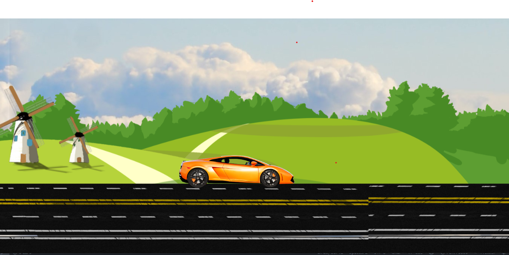

# Car Animation

This is a simple animated car project built using HTML, CSS, and JavaScript.

## 🚗 Features

- Animated background (trees, road)
- Moving car with rotating wheels
- Background shake animation
- Background sound effect (`sound.mp3`)

## 📂 Project Structure
<pre>CarAnimationProject/
├── index.html
├── style.css
├── script.js
├── screenshot.png
├── car_body.png
├── car_wheel_left.png
├── car_wheel_right.png
├── background.jpg
├── trees.png
├── track.png
└── sound.mp3 </pre>

## 🛠️ How to Run

1. Download the code or clone the repo.
2. Open `index.html` in browser.
3. Make sure all images and `sound.mp3` are in same folder.

## 📷 Preview

